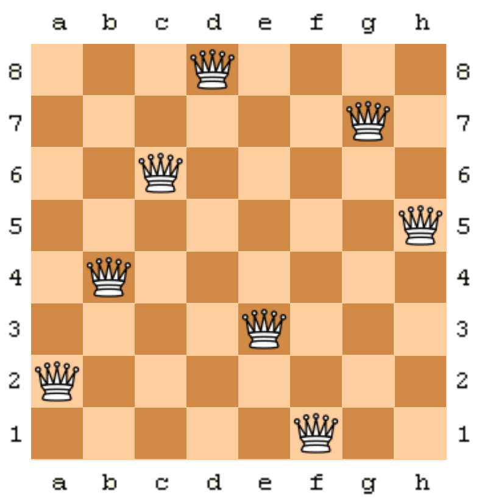

# n-queens
A simple Java implementation of the n-queens problem.

The program uses backtracking without recursion and is parallelized using Java multithreading.

One of the 92 possible solutions with N=8 (Wikipedia)

Up to now, the N=27 is the highest board that has been computed (complete sequence in the [OEIS](https://oeis.org/A002562)). My highest board solved with this program was N=18 (if I remember correctly).
